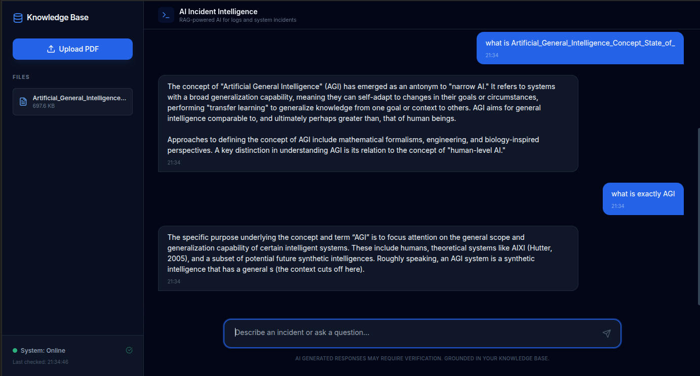

<div align="center">

</div>


# 🧠 AI Incident Intelligence Platform

> **AI-powered platform for analyzing system incidents and technical documents using Gemini LLM and Retrieval-Augmented Generation (RAG).**

AI Incident Intelligence is a full-stack, production-ready AI system that allows users to upload PDFs (logs, incident reports, manuals) and ask intelligent questions about them.
The system uses **Gemini LLM**, **vector search (FAISS)**, and **RAG** to provide grounded, context-aware answers.

---

##  Features

* 📄 Upload and index multiple PDF documents
* 🔍 Semantic search using vector embeddings
* 🤖 Gemini LLM for reasoning and answers
* 🧠 Retrieval-Augmented Generation (RAG)
* 💬 Chat-based UI (React + TypeScript)
* 🐳 Fully Dockerized backend
* 🌐 Browser-ready (CORS enabled)
* ☁️ Cloud-ready architecture (AWS / GCP / any VM)

---

## 🏗️ System Architecture

```
Frontend (React / Vite)
        |
        v
FastAPI Backend (Docker)
        |
        ├── PDF Upload
        ├── Text Chunking
        ├── Embeddings
        ├── FAISS Vector DB
        └── Gemini LLM API
```

---

## 🛠️ Tech Stack

### Backend

* Python
* FastAPI
* Gemini API (Google)
* FAISS (Vector DB)
* Sentence Transformers
* PyPDF2

### Frontend

* React + TypeScript
* Vite
* Modern SaaS UI

### Infrastructure

* Docker
* Docker Compose
* Environment variables
* Volumes for persistence

---

## 📁 Project Structure

```
ai-incident-intelligence/
├── backend/           # FastAPI + RAG logic
├── frontend/          # React UI
├── data/pdfs/         # Uploaded PDFs
├── vector_store/      # FAISS index
├── docker-compose.yml
└── README.md
```
## Full PROJECT STRUCTURE
``` ai-incident-intelligence
├── backend
│   ├── Dockerfile
│   ├── embeddings.py
│   ├── gemini.py
│   ├── main.py
│   ├── __pycache__
│   │   ├── gemini.cpython-310.pyc
│   │   └── main.cpython-310.pyc
│   ├── rag.py
│   ├── requirements.txt
│   └── test.py
├── components
│   ├── ChatWindow.tsx
│   └── Sidebar.tsx
├── data
│   └── pdfs
├── docker-compose.yml
├── frontend
│   ├── App.tsx
│   ├── components
│   │   ├── ChatWindow.tsx
│   │   └── Sidebar.tsx
│   ├── index.html
│   ├── index.tsx
│   ├── metadata.json
│   ├── package.json
│   ├── README.md
│   ├── services
│   │   └── api.ts
│   ├── tsconfig.json
│   ├── types.ts
│   └── vite.config.ts
├── README.md
├── services
│   └── api.ts
└── vector_store
    ├── index.faiss
    └── meta.pkl
```
---

##  Setup & Run (Local)

### 1. Clone the repo

```bash
git clone https://github.com/your-username/ai-incident-intelligence.git
cd ai-incident-intelligence
```

### 2. Add Gemini API key

Create a `.env` file:

```env
GEMINI_API_KEY=your_api_key_here
```

### 3. Run with Docker

```bash
docker compose up --build
```

Backend will be available at:

```
http://localhost:8000
```

API docs:

```
http://localhost:8000/docs
```

Frontend:

```
http://localhost:5173
```

---

##  API Endpoints

### Health

```http
GET /health
```

### Upload PDF

```http
POST /upload
Content-Type: multipart/form-data
```

### Ask Question

```http
POST /ask
Content-Type: application/json

{
  "question": "What is this document about?"
}
```

---

##  How RAG Works

1. User uploads PDF
2. Text is extracted and chunked
3. Each chunk is embedded into vectors
4. Vectors stored in FAISS
5. User asks a question
6. Relevant chunks retrieved
7. Gemini answers using retrieved context

This ensures:

* Lower API cost
* Better accuracy
* No hallucinations

---

##  Example Use Cases

* Analyze system error logs
* Search technical documentation
* AI DevOps assistant
* Incident root cause analysis
* Internal knowledge base

---

##  Example cURL Test

Upload PDF:

```bash
curl -X POST http://localhost:8000/upload \
  -F "file=@example.pdf"
```

Ask question:

```bash
curl -X POST http://localhost:8000/ask \
  -H "Content-Type: application/json" \
  -d '{"question":"Summarize this document"}'
```

---

##  Deployment

This system can be deployed to:

* AWS EC2
* Google Cloud VM
* DigitalOcean
* Any Linux server

Steps:

```bash
sudo apt install docker.io docker-compose -y
git clone your-repo
cd ai-incident-intelligence
docker compose up -d
```

---

##  Security Notes

* API keys are stored in environment variables
* `.env` should never be committed
* In production, restrict CORS and use HTTPS

---

##  Future Improvements

* Multi-user authentication
* Streaming responses
* Cost monitoring dashboard
* Source citation per answer
* Redis caching
* Pinecone / Weaviate support

---

##  Author

**Mohammed Kahab K**
AI / ML Engineer

> This project demonstrates real-world skills in:
>
> * Applied AI engineering
> * RAG systems
> * Cloud LLM integration
> * Dockerized production systems

---


